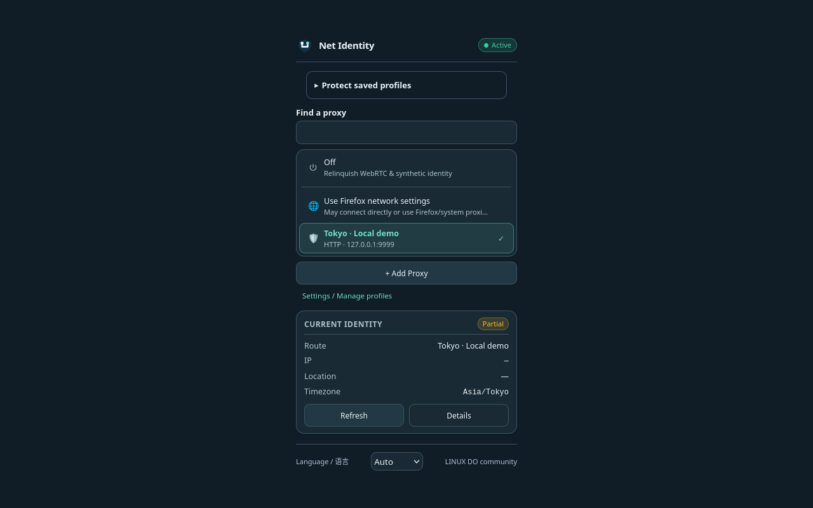

# Net Identity

为 Firefox 管理代理配置，并让网页可见的位置、时区与 WebRTC 策略随线路一起切换。

[Firefox 官方安装页](https://addons.mozilla.org/zh-CN/firefox/addon/net-identity/) ·
[English](README.md) · [快速上手](docs/QUICKSTART.zh-CN.md) ·
[问题反馈](https://github.com/jacek4yang/net-identity/issues)

仅支持 Firefox 桌面版 140 及以上。你需要自备代理服务器；本扩展不提供 VPN 或代理服务。

可选主密码保险库让配置与代理密码一起加密保存，支持加密备份；升级保留已有配置，首次启用时迁移。完整退出 Firefox 后需要重新解锁。详细边界见[加密存储与恢复](docs/ENCRYPTED-VAULT.md)。

## 先看版本范围

本文描述 1.2.0 源码中的紧凑中英文界面、浅色／深色主题、代理快速添加与加密保险库。
准备发布源码本身不代表已经上架。实际发布版及签名安装包以
[AMO](https://addons.mozilla.org/zh-CN/firefox/addon/net-identity/)和
[GitHub Releases](https://github.com/jacek4yang/net-identity/releases)为准。
现有发布标签、签名文件与历史审核记录不被覆盖。

以下是仓库保留的真实 Firefox 界面截图，不是新交互的完成效果图：



## 它能做什么

- 一次点击切换代理配置，支持 HTTP、HTTPS、SOCKS4 和 SOCKS5。
- 将代理与网页位置、时区和 WebRTC 设置放在同一份配置中管理。
- 区分保存与应用：保存不会偷偷切换正在使用的线路。
- 未启用保险库时，用户名、密码仅保留到 Firefox 退出；启用后加密持久保存，重启后解锁即可恢复已应用配置。
- 自动模式通过当前线路检测出口 IP；手动模式支持坐标、精度和 IANA 时区。
- 展示实际应用状态、身份一致性和失败原因，而不是只显示一个“安全”标记。
- 地图初始离线；首次手动加载后可记住自动加载偏好，每次打开仍重新检查线路、认证与许可。
- 无遥测，不加载远程可执行代码。地图渲染器及其 worker 随扩展打包。

## 如何开始

打开弹窗内的“添加代理”，输入如 `127.0.0.1:10808` 并确认协议；需要认证时单独填写
用户名、密码。完整地址会自动通过该代理检测出口，不改变正在使用的浏览线路。
“保存”只保留编辑，“保存并启用”保存当前表单并切换线路。也可在设置页管理配置。
完整步骤见[快速上手](docs/QUICKSTART.zh-CN.md)。

新建代理默认采用严格的仅代理 WebRTC 策略，SOCKS 默认开启代理 DNS，位置和时区自动
跟随出口。已有配置不会被静默改写。仅代理 WebRTC 可能影响没有代理 TURN/TCP 通道的
网页通话；可以在高级设置中明确调整，界面会保留真实策略状态。

## 关闭与浏览器路由有什么区别

- **关闭（Off）**：释放扩展对模拟身份和 WebRTC 的控制，恢复此前浏览器策略。
- **浏览器／系统路由（内置 Direct）**：不配置扩展代理，仍使用 Firefox 和系统的路由。
  如果你在其他地方设置了代理，它不保证绕过那些代理直连互联网。
- **代理配置**：普通、可被扩展观察的网页流量使用选定代理，或失败，不会在代理故障时
  静默改走 Direct。明确的绕过规则仍生效；本地回环地址始终绕过。

## 认证、DNS 与连接故障

SOCKS5 支持用户名／密码；SOCKS4 不支持认证。HTTP／HTTPS 使用预先提供的 Basic
代理认证头，并严格核对代理认证挑战的地址和端口。明文凭据不写入持久配置，也不发送给网页或 GeoIP 服务商。

Firefox 的 `proxyDNS` 控制适用于 SOCKS；不要把它理解成能接管操作系统的全部 DNS。
未启用保险库时，关闭并重开 Firefox 会丢失会话凭据；需要认证的已选代理会限制普通网页访问，
重新填写并启用后恢复。启用保险库后，配置与凭据加密保留，完整重启后需要解锁；解锁恢复
原先已应用的配置，不会偷偷应用较新的已保存编辑。保存凭据本身不会切换线路。
请导出加密备份；主密码无法重置，恢复仅支持空白安装。存储加密不等于加密代理认证连接。

## 隐私与限制

- 安装扩展本身不会启动 GeoIP 查询。启用、刷新自动身份，或在编辑器输入有效代理地址后
  的自动预览可能请求 ipwho.is。预览只让检测请求经过草稿代理，不保存配置或凭据。
  设置页中禁用 GeoIP 可阻止草稿检测；弹窗快速添加按设计自动预览。通过代理时服务商看到
  代理出口；浏览器路由下查询自己的公网 IP 需要先获得许可。
- GeoIP 坐标是粗略位置，通常约 20 公里精度，不是 GPS 定位。
- 加载在线地图会将当前连接的公网 IP 和查看区域发送给 OpenFreeMap 及其基础设施。
  首次加载后可自动加载后续打开的可见地图；“卸载地图”或取消自动加载可关闭该偏好。
  每次打开重新检查当前线路与许可，线路变化会取消旧会话。本地坐标网格仍可离线使用。
- 网页位置和时区由兼容层实现，可能被复杂网页脚本识别，不保证指纹隐身。
- Firefox 禁止扩展访问的页面、框架和受保护系统请求存在能力边界。本扩展不是浏览器级
  或操作系统级的万能断网开关。
- 如果其他扩展或企业策略控制 WebRTC，会报告控制权问题，不会假装已经设置成功。
- 要保证代理账户身份，服务器必须拒绝匿名访问；HTTP／HTTPS 服务器若接受匿名 CONNECT，
  仅配置凭据不能证明每个请求都使用了该账户。此限制也适用于普通网页与地图请求。

详见[隐私说明](docs/PRIVACY.md)、[安全约束](docs/SECURITY.md)与
[地图数据策略](docs/TILE-POLICY.md)。Mozilla 的安全监控提示取决于其审核机制；开源、
自动化测试或签名通过均不等于获得 Mozilla Recommended 认证。

## 从其他代理管理器迁移

协议、主机、端口与配置名称仍是熟悉的概念。先在 Net Identity 手动创建一个配置，核对
代理与认证，然后明确启用。不要同时让多个扩展争夺代理设置。离开旧配置前保留它的设置。

目前不宣称支持 FoxyProxy／SwitchyOmega 配置文件的一键导入。不要将带密码的导出文件
粘贴到 Issue。参见[迁移及排错指南](docs/QUICKSTART.zh-CN.md#从其他扩展迁移)。

## 开发与质量验证

需要 Node.js 22 及以上与 npm：

```bash
npm ci
npm run check
npm run package
npm run dev -- --firefox="/path/to/firefox"
```

源码采用 TypeScript 与原生 DOM，不使用前端框架。构建和单元测试之外，CI 还运行真实
Firefox 的认证、WebSocket、故障关闭、重启、会话凭据、地图与交互测试。
本地生成的未签名 ZIP 不等于可发布的签名 XPI。发布必须经过独立的 Mozilla 签名、
产物来源核验及正式安装验证。详见[CI](docs/CI.md)和[发布流程](docs/RELEASING.md)。

## 帮助与社区

- 功能问题：[GitHub Issues](https://github.com/jacek4yang/net-identity/issues)
- 安全漏洞：请按 [SECURITY.md](SECURITY.md) 私下报告，不在公开 Issue 提交凭据
- 贡献：[CONTRIBUTING.md](CONTRIBUTING.md)
- 社区资源：[LINUX DO](https://linux.do/)，独立社区链接，不表示合作、赞助或安全背书

许可证：MIT。

### 自动检测与一键启用

填写完整代理地址、端口及必要认证后，编辑器会自动通过该代理查询 ipwho.is，
预览实测出口 IP、大致位置和时区。检测不会切换现有浏览线路，不保存密码或配置。
改动输入会使旧结果失效；失败时保留输入并可重新检测，不会无限重试。
「保存并启用」使用当前表单，一次完成保存和启用；单独「保存」仍不切换线路。
关闭 GeoIP 查询时不发送自动检测请求，手动位置和时区也不会被预览覆盖。
检测成功不等于已经启用；请分别核对线路状态与身份诊断。
